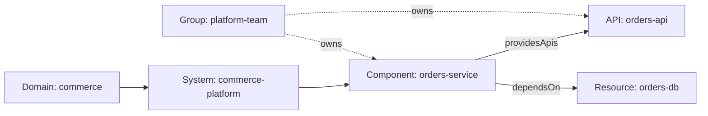

<p align="center">
  
</p>

# Anchored Spec

[](https://github.com/idvexchange/anchored-spec/actions/workflows/ci.yml)
[](https://github.com/idvexchange/anchored-spec/releases)
[](LICENSE)

> Backstage-aligned architecture control plane for repositories that want a real architecture model in version control.

**Status:** pre-1.0. Public API, CLI surface, and entity schemas may change between minor versions. See [CHANGELOG](CHANGELOG.md).

## Contents

- [Why Anchored Spec Exists](#why-anchored-spec-exists)
- [Operating Boundary](#operating-boundary)
- [Is This For You?](#is-this-for-you)
- [What You Can Do With It](#what-you-can-do-with-it)
- [Quickstart](#quickstart)
- [The Core Model](#the-core-model)
- [Storage Modes](#storage-modes)
- [Impact and Command Suggestions](#impact-and-command-suggestions)
- [Command Surface](#command-surface)
- [Documentation](#documentation)
- [AI Agent Workflow](#ai-agent-workflow)
- [Contributing](#contributing)

Anchored Spec turns a repository into a living architecture model. You author [Backstage-style entities](https://backstage.io/docs/features/software-catalog/descriptor-format/) in version control, link those entities to architecture documents and primary code locations, and then run validation, traceability, discovery, drift detection, reporting, and change-review workflows over the same model.

Its best operating shape is deliberately narrow:

- Anchored Spec owns architecture truth, queryability, and declared-vs-observed pressure.
- The CLI is the normal interface to that control plane for humans and agents.
- Repositories still own last-mile task execution, focused verification, and workflow ergonomics.

## Adoption Pattern

This repository is the canonical manifest-mode example, deliberately set up the way Anchored Spec recommends adopting repos use it:

- `catalog-info.yaml` — a sparse root entity manifest, the architectural source of truth.
- `docs/` — linked markdown explaining and tracing back to the entities.
- `.anchored-spec/` — machine-readable framework and harness collateral (`config.json`, `policy.json`, query packs, task briefs).
- `scripts/` — the repo-local harness itself (`task-start`, `task-verify`, `task-check`, `task-close` plus a shared `harness-lib`), exposed as `pnpm task:*` commands. The harness is *this repo's* last-mile workflow glue. It is **not** part of the published `anchored-spec` package. Other adopting repos write their own equivalent: a few scripts, a Makefile, a task runner that are tailored to their stack.

## Why Anchored Spec Exists

Most architecture tooling falls apart for one of two reasons:

- The model is separate from the repo, so it drifts.
- The docs are prose-only, so automation cannot trust them.

Anchored Spec takes a different position:

- Architecture should live next to code.
- The source of truth should be typed and reviewable.
- Docs should explain the model, not replace it.
- Discovery and drift should pressure-test the model, not silently overwrite it.
- AI agents should consume the same architecture graph as humans.

## Operating Boundary

Anchored Spec should usually be:

- Sparse.
- Architecture-first.
- Local-first.
- Reviewable.
- Queryable by humans and agents.

Anchored Spec should usually not be:

- The full repo harness.
- The full verification orchestrator.
- A mandatory discovery-first system.
- A codebase-wide dependency graph product.
- The owner of every repository-specific workflow decision.

## Is This For You?

Anchored Spec is opinionated about where it pays off. Use this as a rough decision rule before adopting it:

| Situation                                                | Verdict                                                                  |
| -------------------------------------------------------- | ------------------------------------------------------------------------ |
| 1–3 services, small team, no AI agents                   | **Skip.** A README and a few ADRs are enough.                            |
| 5–30 services, growing, onboarding pain, some agent use  | **Strong fit.** This is the best ROI zone.                               |
| Large org already on Backstage                           | **Complement.** Use it as the in-repo authoring layer feeding Backstage. |
| Heavily regulated or audit-driven                        | **Strong fit** for traceability, provided the model has a named owner.   |
| AI-agent-heavy engineering org                           | **Strong fit** — giving agents a clean architecture surface is the most novel value. |
| No one will own the model                                | **Don't bother** — like every architecture-as-code tool, it dies the moment PRs stop updating it. |

The single biggest risk is the same as every "X-as-code" framework: it is only as alive as the discipline around it. The framework gives you the right primitives and the right pressure (`validate`, `drift`, `diff --policy`), but it cannot make a team care. Pair adoption with a named owner and a CI gate, or expect it to become wallpaper.

## What You Can Do With It

- Author architecture as Backstage-aligned entities in YAML or markdown frontmatter.
- Bootstrap a curated first-pass model from existing repository evidence.
- Validate schema, relations, ownership, lifecycle, and traceability.
- Detect drift between the declared model and observed repository reality.
- Review changes semantically with compatibility and policy checks.
- Hand humans and AI agents the same queryable architecture graph.

See the [documentation portal](docs/README.md) for the full capability surface.

## Quickstart

### Install

```bash
pnpm add -D anchored-spec
```

### Initialize a repository

```bash
pnpm exec anchored-spec init --mode manifest
```

Add `--with-examples` for a neutral reference shape: one owner, one domain, one system, one component, one API, and linked docs.

### Create the first model slice

If the architecture is already clear, create entities directly:

```bash
pnpm exec anchored-spec create --kind Component --type service --title "Orders Service" --owner group:default/platform-team
pnpm exec anchored-spec create --kind API --type openapi --title "Orders API" --owner group:default/platform-team
```

If the repository already has meaningful structure and docs, bootstrap a curated manifest first:

```bash
pnpm exec anchored-spec catalog bootstrap --dry-run
pnpm exec anchored-spec catalog bootstrap --dry-run --explain
pnpm exec anchored-spec catalog bootstrap --write catalog-info.yaml
```

If you are not sure which descriptor shape to use, inspect the supported options:

```bash
pnpm exec anchored-spec create --list
```

### Inspect and run the loop

```bash
pnpm exec anchored-spec validate
pnpm exec anchored-spec trace --summary
pnpm exec anchored-spec graph --format mermaid --focus component:default/orders-service --depth 1
pnpm exec anchored-spec drift
pnpm exec anchored-spec diff --base main --compat --policy
pnpm exec anchored-spec report --view traceability-index
pnpm exec anchored-spec context component:default/orders-service --tier llm
pnpm exec anchored-spec impact component:default/orders-service --with-commands --format markdown
```

Treat command suggestions from `impact --with-commands` as a thin handoff into repository-native scripts, not as the final owner of your command plan. See [Impact and Command Suggestions](#impact-and-command-suggestions) for the JSON payload shape.

## The Core Model

Entities relate through a small, opinionated set of architectural shapes. A typical slice looks like this:



Anchored Spec uses the Backstage entity envelope:

```yaml
apiVersion: backstage.io/v1alpha1
kind: Component
metadata:
  name: orders-service
  title: Orders Service
  description: Handles order placement and orchestration.
  annotations:
    anchored-spec.dev/source: docs/04-component/orders-service.md
    anchored-spec.dev/code-location: src/orders/
spec:
  type: service
  lifecycle: production
  owner: group:default/platform-team
  system: commerce-platform
  providesApis:
    - api:default/orders-api
  dependsOn:
    - resource:default/orders-db
```

Prefer [Backstage built-in kinds](https://backstage.io/docs/features/software-catalog/system-model) when they fit:

- `Component`
- `API`
- `Resource`
- `Group`
- `System`
- `Domain`

Use Anchored Spec custom kinds only when the concept is genuinely architectural and not already covered well by Backstage:

- `Requirement`
- `Decision`
- `CanonicalEntity`
- `Exchange`
- `Capability`
- `ValueStream`
- `Mission`
- `Technology`
- `SystemInterface`
- `Control`
- `TransitionPlan`
- `Exception`

## Storage Modes

### Manifest mode

Entities live in one or more YAML catalog files, usually centered on `catalog-info.yaml`.

```bash
pnpm exec anchored-spec init --mode manifest --with-examples
```

### Inline mode

Entities live in markdown frontmatter, usually inside `docs/`.

```bash
pnpm exec anchored-spec init --mode inline --with-examples
```

Manifest mode is the clearest operating shape for most multi-concern repositories. Inline mode remains useful when the docs themselves are already the primary authoring surface.

## Impact and Command Suggestions

`impact --with-commands` separates its JSON payload so repositories can compose their own command plans on top of architectural truth:

- `architectureImpact` — declared entity blast radius
- `repositoryImpact` — adapter-derived repo-local targets
- `suggestions` — intent-first actions before any repository-specific command handling

Compatibility fields (`commands`, `broaderCommands`, `actionCommands`) remain available for repository wrappers that have not migrated yet.

## Command Surface

| Command        | Use it for                                                                            |
| -------------- | ------------------------------------------------------------------------------------- |
| `init`         | Scaffold config, storage mode, optional examples, AI files, IDE files, and CI recipes |
| `create`       | Create a new entity in the repository's configured storage mode                       |
| `create-doc`   | Create linked architecture or guide documents with frontmatter and trace links        |
| `catalog`      | Bootstrap, plan, apply, and explain a curated catalog synthesized from repo evidence  |
| `link`         | Add a relation between two entities                                                   |
| `validate`     | Validate entities, relations, and quality rules                                       |
| `verify`       | Run broader project verification checks                                               |
| `trace`        | Inspect entity-to-doc traceability                                                    |
| `link-docs`    | Sync doc links and entity trace refs                                                  |
| `discover`     | Discover draft entities or facts from supported source types                          |
| `drift`        | Compare the declared model to observed reality                                        |
| `generate`     | Run built-in generators                                                               |
| `graph`        | Export raw relation graphs                                                            |
| `diagrams`     | Render semantic diagram projections                                                   |
| `report`       | Produce reviewer-facing report views                                                  |
| `impact`       | Analyze downstream impact                                                             |
| `constraints`  | Extract governing decisions and requirements                                          |
| `status`       | Summarize lifecycle, ownership, and confidence                                        |
| `transition`   | Advance lifecycle state with gates                                                    |
| `diff`         | Review semantic changes and compatibility                                             |
| `evidence`     | Ingest, validate, and summarize evidence                                              |
| `reconcile`    | Run a composed maintenance loop                                                       |
| `search`       | Search entities by ref, kind, domain, status, tags, and text                          |
| `batch-update` | Bulk-update entity status or confidence                                               |

## Documentation

Start with the docs portal:

- [Documentation portal](docs/README.md)
- [Adoption overview](docs/start/adoption-overview.md)
- [Choose your path](docs/start/choose-your-path.md)
- [Business architecture](docs/01-business/business-architecture.md)
- [System context](docs/02-system-context/system-context.md)
- [Domain model](docs/05-domain/domain-model.md)
- [Model the repo](docs/workflows/model-the-repo.md)
- [Review and analysis](docs/workflows/review-and-analysis.md)
- [Repository harness](docs/workflows/repository-harness.md)
- [Maintainer architecture](docs/maintainers/architecture.md)

## AI Agent Workflow

Because the architecture model lives in version control as typed entities, agents can consume the same graph that humans review — no separate context-window dance, no parallel "AI memory" of how the system fits together. The CLI is the agent surface.

- [Agent guide](docs/workflows/agent-guide.md)

A concrete handoff: pipe a focused context bundle straight into an agent's clipboard or stdin.

```bash
pnpm exec anchored-spec context component:default/orders-service --tier llm | pbcopy
```

Useful prompts to pair with that context:

```markdown
Add a new API and the component that provides it. Keep the model and docs in sync.

Audit this repo's architecture coverage and identify the missing entities.

Run a semantic diff against main and explain any breaking changes.

Trace every document and source path connected to component:default/orders-service.
```

---

## Contributing

Contributor and maintainer documentation — repository layout, local workflow, build/test/lint commands, and documentation standards — lives in [`CONTRIBUTING.md`](CONTRIBUTING.md).

## License

[MIT](LICENSE)

---

[CHANGELOG](CHANGELOG.md) · [Contributing](CONTRIBUTING.md) · [Documentation](docs/README.md) · [Agent guide](docs/workflows/agent-guide.md)

