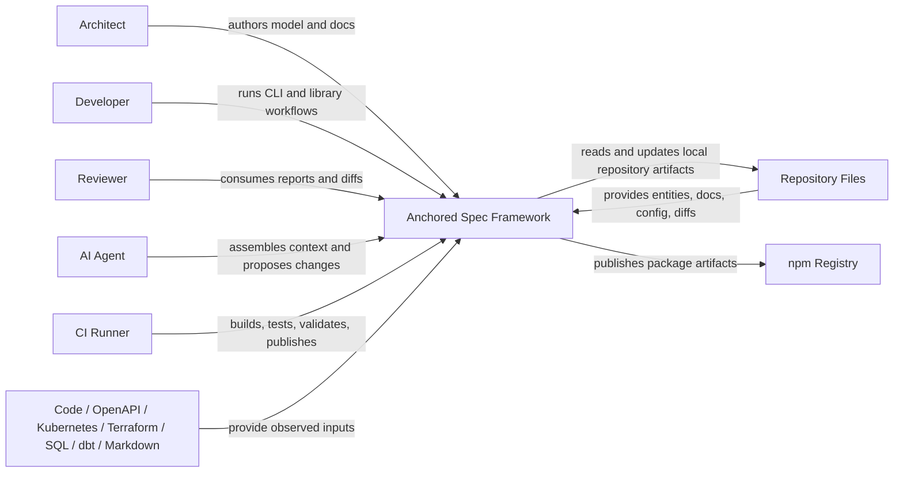

---
ea-entities:
  - system:default/anchored-spec-framework
---

# System Context

This document describes the external actors and systems around Anchored Spec.

## Scope

The system in scope is the Anchored Spec framework package as implemented in this repository.

## Context Diagram

## External Relationships

### Repository files

The repository is the primary integration boundary. Anchored Spec reads and writes local artifacts rather than depending on a service backend.

### Source material for discovery

Discovery integrates with existing technical truth such as:

- OpenAPI
- Kubernetes manifests
- Terraform state
- SQL DDL
- dbt manifests
- markdown
- source code through tree-sitter

### CI and release infrastructure

The framework is exercised in GitHub Actions and published to npm. The shipped workflow is defined in `.github/workflows/ci.yml`.

### Human and AI consumers

The same architecture model is intended to serve architects, implementers, reviewers, and agents. That is a core design constraint, not a side effect.
