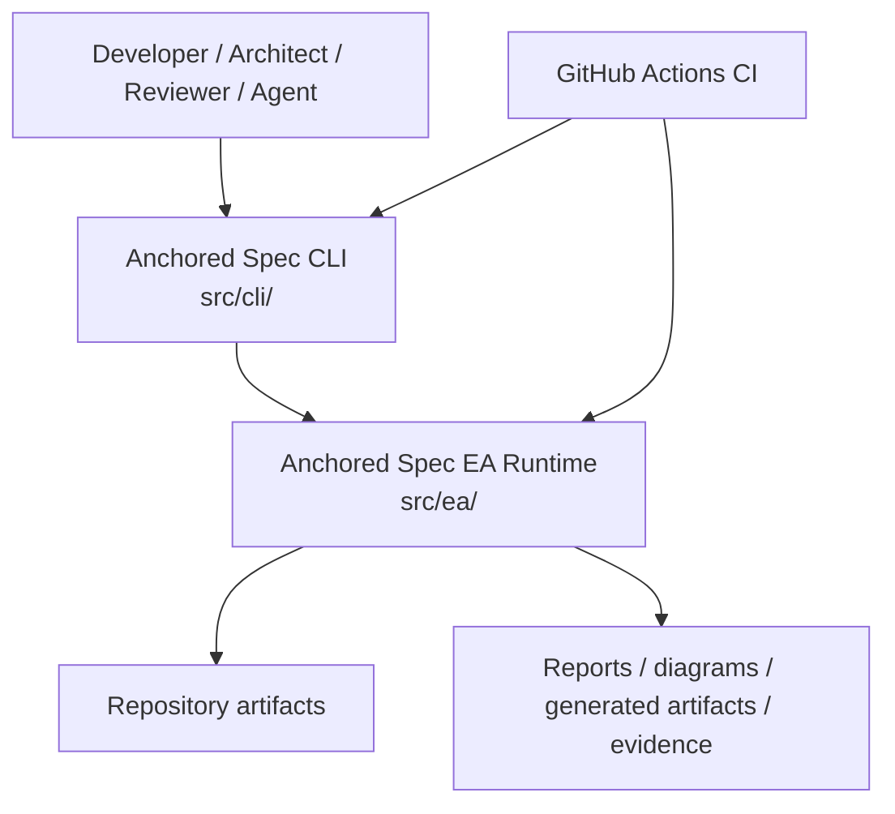

# Container Architecture

This document describes the main runtime containers inside the Anchored Spec framework in the C4 sense: separately meaningful runtime surfaces, not deployment containers.

## Container Diagram

## Containers

### Anchored Spec CLI

- path: `src/cli/`
- responsibility: public command surface, user interaction, formatting, file-oriented workflows
- consumers: developers, reviewers, CI jobs, AI agents using shell tools

### Anchored Spec EA Runtime

- path: `src/ea/`
- responsibility: loading, validation, graph analysis, discovery, drift, generation, reporting, policy, evidence, and reconciliation
- consumers: CLI and programmatic Node consumers

### Repository artifacts

- examples: `.anchored-spec/config.json`, authored entities, markdown docs, generated outputs, cache files
- role: persistent input and output store for the framework

## Container Relationships

- The CLI depends on the EA runtime for almost all architecture behavior.
- The EA runtime reads and writes local repository artifacts.
- CI exercises the same CLI and runtime surfaces as local users.
- No remote service is required for the core workflow.

## Why This Boundary Matters

The two-container split keeps the architecture honest:

- the CLI is the operational surface
- the EA runtime is the reusable architecture engine

Everything else in the codebase is an internal component of one of those two containers.
