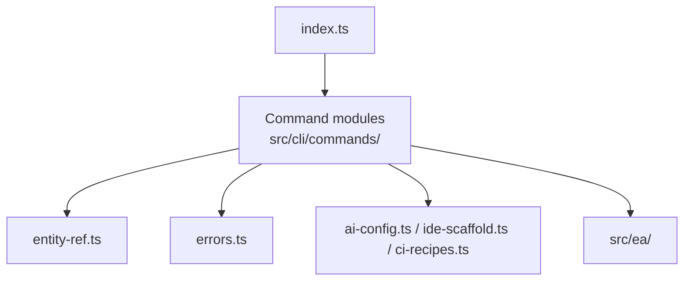

# Anchored Spec CLI

This document breaks down the `src/cli/` container into its main components.

## Responsibilities

- parse command-line input
- route commands to the correct workflow
- present human-readable and machine-readable output
- scaffold supporting files for AI, IDE, and CI workflows
- bridge repository-local file operations into the EA runtime

## Component Diagram

## Key Components

### Command router

- file: `src/cli/index.ts`
- role: registers the public command surface and applies global options such as `--cwd`

### Command handlers

- path: `src/cli/commands/`
- role: implement command-specific orchestration for `init`, `create`, `validate`, `discover`, `drift`, `report`, `impact`, `constraints`, `reconcile`, and related workflows

### Entity reference resolution

- file: `src/cli/entity-ref.ts`
- role: resolve user input into canonical entity refs and provide suggestion logic

### Error model

- file: `src/cli/errors.ts`
- role: normalize command failure into testable `CliError` instances with exit codes

### Scaffolding helpers

- files: `src/cli/ai-config.ts`, `src/cli/ide-scaffold.ts`, `src/cli/ci-recipes.ts`
- role: generate supporting files that help teams operationalize the framework

## Design Notes

- The CLI is thin by design. Domain logic belongs in `src/ea/`.
- Commands favor explicit flags and markdown-friendly output.
- JSON output exists where downstream automation needs structured results.

## Test Coverage

The CLI has dedicated tests under `src/cli/__tests__/`, including:

- command routing
- docs-related commands
- context assembly
- CI recipe generation
- agent prompt scaffolding
