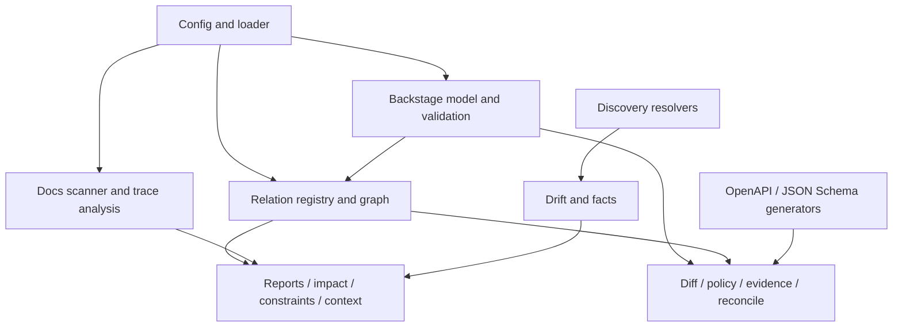

# Anchored Spec EA Runtime

This document breaks down the `src/ea/` container into its main components.

## Responsibilities

- load the configured architecture model
- validate entities and relations
- build graph and traversal views
- discover draft entities and observed state
- detect drift
- generate derived artifacts
- assemble reports, impact views, constraints, and context
- apply policy, evidence, and reconcile workflows

## Component Diagram

## Key Components

### Config and loader

- files: `src/ea/config.ts`, `src/ea/loader.ts`
- role: resolve storage mode, project config, and the loaded entity graph

### Backstage model and validation

- path: `src/ea/backstage/`
- role: parsing, kind mapping, accessors, schema handling, and writer utilities

### Relation registry and graph

- files: `src/ea/relation-registry.ts`, `src/ea/graph.ts`
- role: normalize relations and provide traversal logic for impact and governance

### Docs and trace analysis

- path: `src/ea/docs/`
- files: `src/ea/source-scanner.ts`, `src/ea/trace-analysis.ts`
- role: connect markdown and source hints to the architecture model

### Discovery resolvers

- path: `src/ea/resolvers/`
- role: observe source material and convert it into draft entities or observed state

### Drift and facts

- files: `src/ea/drift.ts`
- path: `src/ea/facts/`
- role: compare declared architecture to extracted or observed material

### Reports and analysis

- files: `src/ea/report.ts`, `src/ea/impact.ts`, `src/ea/constraints.ts`
- role: produce reviewer-facing outputs over one shared graph

### Generators

- path: `src/ea/generators/`
- role: derive OpenAPI and JSON Schema artifacts from the authored model

### Governance

- files: `src/ea/diff.ts`, `src/ea/policy.ts`, `src/ea/version-policy.ts`, `src/ea/evidence.ts`, `src/ea/reconcile.ts`, `src/ea/verify.ts`
- role: semantic change review, evidence handling, policy enforcement, and end-to-end orchestration

## Design Notes

- The runtime is intentionally wider than the top-level architecture model.
- Internal complexity is organized by capability seam rather than by separate deployable service.
- All exported public behavior is re-exported through `src/ea/index.ts` and then `src/index.ts`.
