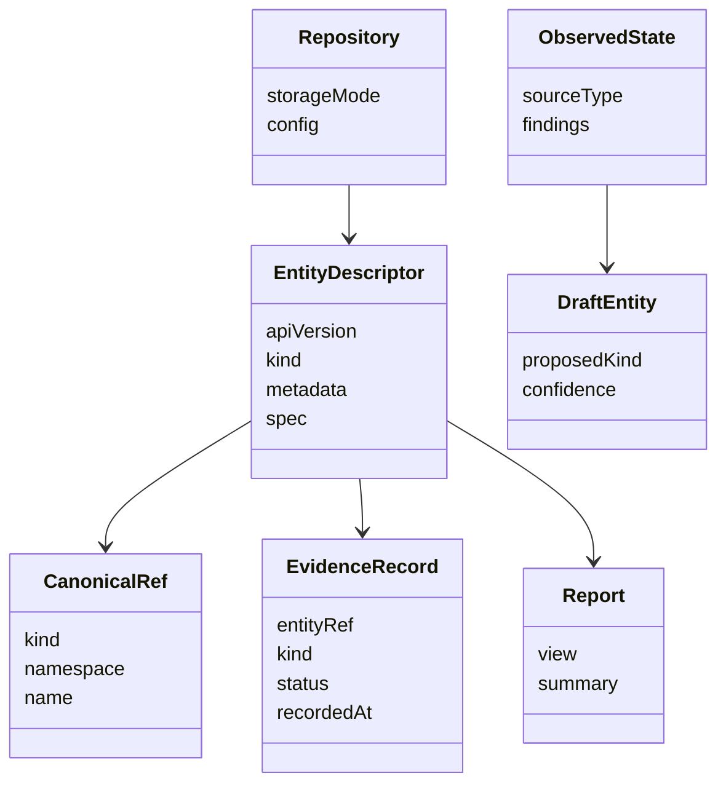

# Domain Model

This document describes the core concepts that make up the Anchored Spec domain.

## Concept Map

## Primary Aggregates

### Repository model

The repository model is the top-level working context. It includes:

- configuration
- authoring mode
- loaded entities
- documentation and source references
- generated outputs and cache state

### Entity descriptor

The entity descriptor is the central business object. All important workflows converge on it:

- validation
- graph building
- reporting
- discovery matching
- policy evaluation

### Observed state

Observed state is produced by resolvers and fact extraction. It exists to challenge or bootstrap the declared model, not replace it silently.

### Evidence record

Evidence records attach operational or governance confidence to entities over time.

## Invariants

The framework is built around these invariants:

1. the authored entity model remains primary
2. canonical refs are the stable identity boundary
3. discovery output is reviewable draft or observed input
4. downstream workflows read one shared graph instead of inventing their own

## Important Supporting Concepts

- traversal profiles constrain analysis breadth
- report views project the same model in different ways
- generators derive a small number of artifacts from the authored model
- lifecycle and policy govern how the model changes over time
