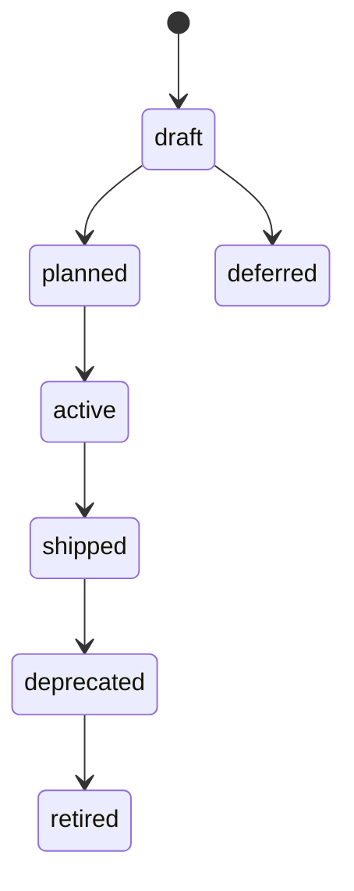

# State Machines

The framework has one especially important state machine today: entity lifecycle progression.

## Entity Lifecycle

The lifecycle statuses are defined in `src/ea/types.ts` and enforced by the transition workflow in `src/cli/commands/ea-transition.ts`.

## Transition Rules

### Activation gate

An entity cannot move to `active` unless:

- it has at least one owner
- it has a meaningful description

### Shipping gate

An entity cannot move to `shipped` unless:

- it has at least one relation to another entity

### Reverse movement

Backward transitions are generally blocked, except that deprecated and retired states can still be targeted explicitly.

## Why This Matters

The lifecycle model is simple on purpose. It is meant to provide useful delivery pressure without turning the framework into a workflow engine.
