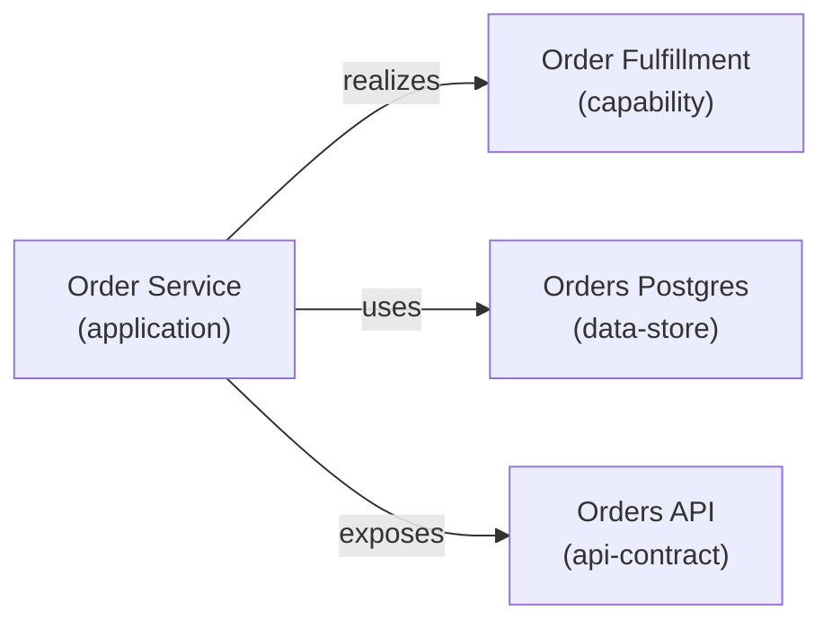
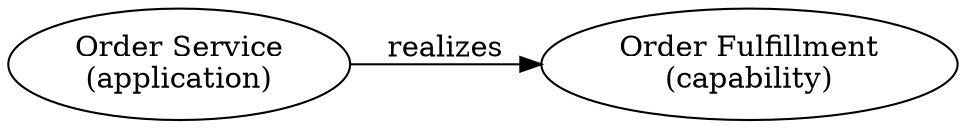

# EA Relationship Model

This document specifies the typed relationship system for the enterprise architecture extension: relation shape, directionality, the relation registry, graph validation, and query patterns.

Read [ea-design-overview.md](./ea-design-overview.md) for context and [ea-unified-artifact-model.md](./ea-unified-artifact-model.md) for the artifact base shape.

## Design Principles

1. **Relations are stored directionally on the source artifact** — the artifact that declares the relation owns it
2. **Inverse relations are computed virtually** by the graph builder — not physically stored
3. **Explicit inverse overrides** are allowed when the virtual inverse is semantically incorrect (rare)
4. **The relation registry is the canonical authority** for which directions and kind-pairs are valid
5. **Relations carry confidence and provenance** just like artifacts

## Relation Shape

Every relation stored on an artifact conforms to this shape:

```typescript
export interface Relation {
  /** The relation type — must be a canonical direction from the registry */
  type: string;

  /** Target artifact ID (fully qualified or short form) */
  target: string;

  /** Human-readable description of this specific relationship */
  description?: string;

  /** How critical this relationship is */
  criticality?: "low" | "medium" | "high" | "critical";

  /** Whether this relation is still active */
  status?: "active" | "deprecated";

  /** How this relation was established */
  confidence?: "declared" | "observed" | "inferred";

  /** Change record that introduced this relation */
  introducedBy?: string;

  /** Change record that deprecated this relation */
  deprecatedBy?: string;

  /** Evidence supporting this relation */
  evidenceRefs?: string[];
}
```

Required fields: `type`, `target`.

Default values when omitted:
- `criticality`: `"medium"`
- `status`: `"active"`
- `confidence`: inherits from parent artifact's `confidence`

### JSON Example

```json
{
  "relations": [
    {
      "type": "realizes",
      "target": "business/CAP-order-fulfillment",
      "description": "Order Service is the primary realizer of the Order Fulfillment capability.",
      "criticality": "high",
      "confidence": "declared"
    },
    {
      "type": "uses",
      "target": "data/STORE-orders-postgres",
      "criticality": "high"
    },
    {
      "type": "exposes",
      "target": "systems/API-orders-api"
    }
  ]
}
```

## Directionality Model

### Canonical Direction

Every relation type has exactly one **canonical direction** — the direction that is physically stored. The canonical direction is chosen to match the natural reading order of the relationship:

- `application` **realizes** `capability` (canonical: stored on application)
- `application` **uses** `data-store` (canonical: stored on application)
- `deployment` **deploys** `application` (canonical: stored on deployment)

### Virtual Inverses

The graph builder computes inverse relations automatically. When `APP-order-service` stores `realizes → CAP-order-fulfillment`, the graph builder makes `CAP-order-fulfillment` accessible via the virtual inverse `realizedBy → APP-order-service`.

Virtual inverses are:
- **not stored in JSON files** — they exist only in the in-memory graph
- **available in query results** — graph queries, reports, and impact analysis can traverse both directions
- **generated in graph exports** — Mermaid, DOT, and adjacency JSON include both directions

### Explicit Inverse Override

In rare cases where the virtual inverse is semantically wrong or needs additional metadata, an explicit inverse can be stored on the target artifact. When an explicit inverse exists, it takes precedence over the virtual one.

Example: A `deployment` stores `deploys → APP-order-service`. The virtual inverse on `APP-order-service` would be `deployedBy → DEPLOY-order-service-prod`. If the application needs to annotate this with criticality, it can store an explicit `deployedTo` relation:

```json
{
  "id": "systems/APP-order-service",
  "relations": [
    {
      "type": "deployedTo",
      "target": "delivery/DEPLOY-order-service-prod",
      "criticality": "critical",
      "description": "Explicit override — production deployment is critical path"
    }
  ]
}
```

The relation registry marks which types support explicit overrides.

## Relation Registry

The relation registry is implemented in `src/ea/relation-registry.ts`. It is the single source of truth for relation semantics.

### Registry Entry Shape

```typescript
export interface RelationRegistryEntry {
  /** The canonical relation type name */
  type: string;

  /** The computed inverse type name (used in virtual inverse generation) */
  inverse: string;

  /** Which artifact kinds can be the source of this relation */
  validSourceKinds: string[] | "*";

  /** Which artifact kinds can be the target of this relation */
  validTargetKinds: string[] | "*";

  /** Whether cycles are allowed in this relation type */
  allowCycles: boolean;

  /** Whether the target artifact can store an explicit inverse override */
  allowExplicitInverse: boolean;

  /** Which drift resolver strategy applies to this relation family */
  driftStrategy?: "anchor-resolution" | "graph-integrity" | "external-topology" | "none";

  /** Human-readable description */
  description: string;
}
```

### Registry Data

#### Phase A Relations (Systems + Delivery)

```typescript
const PHASE_A_RELATIONS: RelationRegistryEntry[] = [
  {
    type: "realizes",
    inverse: "realizedBy",
    validSourceKinds: ["application", "service", "integration"],
    validTargetKinds: ["capability", "business-service", "requirement"],
    allowCycles: false,
    allowExplicitInverse: false,
    driftStrategy: "graph-integrity",
    description: "Source system realizes a business capability or requirement."
  },
  {
    type: "uses",
    inverse: "usedBy",
    validSourceKinds: ["application", "service", "integration"],
    validTargetKinds: ["data-store", "application", "service", "api-contract"],
    allowCycles: false,
    allowExplicitInverse: false,
    driftStrategy: "anchor-resolution",
    description: "Source system uses a data store or another system."
  },
  {
    type: "exposes",
    inverse: "exposedBy",
    validSourceKinds: ["application", "service"],
    validTargetKinds: ["api-contract", "event-contract"],
    allowCycles: false,
    allowExplicitInverse: false,
    driftStrategy: "anchor-resolution",
    description: "Source system exposes an API or event contract."
  },
  {
    type: "consumes",
    inverse: "consumedBy",
    validSourceKinds: ["application", "service", "consumer"],
    validTargetKinds: ["api-contract", "event-contract"],
    allowCycles: false,
    allowExplicitInverse: false,
    driftStrategy: "external-topology",
    description: "Source system consumes an API or event contract."
  },
  {
    type: "dependsOn",
    inverse: "dependedOnBy",
    validSourceKinds: "*",
    validTargetKinds: "*",
    allowCycles: false,
    allowExplicitInverse: false,
    driftStrategy: "graph-integrity",
    description: "Source artifact depends on target artifact for functionality."
  },
  {
    type: "deploys",
    inverse: "deployedBy",
    validSourceKinds: ["deployment"],
    validTargetKinds: ["application", "service"],
    allowCycles: false,
    allowExplicitInverse: true,
    driftStrategy: "anchor-resolution",
    description: "Deployment artifact deploys an application or service."
  },
  {
    type: "runsOn",
    inverse: "runs",
    validSourceKinds: ["deployment", "application", "service", "data-store"],
    validTargetKinds: ["platform", "runtime-cluster", "cloud-resource"],
    allowCycles: false,
    allowExplicitInverse: false,
    driftStrategy: "anchor-resolution",
    description: "Source runs on a platform or cluster."
  },
  {
    type: "boundedBy",
    inverse: "bounds",
    validSourceKinds: ["deployment", "application", "service", "data-store"],
    validTargetKinds: ["network-zone", "identity-boundary"],
    allowCycles: false,
    allowExplicitInverse: false,
    driftStrategy: "anchor-resolution",
    description: "Source is bounded by a network zone or identity boundary."
  },
  {
    type: "authenticatedBy",
    inverse: "authenticates",
    validSourceKinds: ["deployment", "application", "service"],
    validTargetKinds: ["identity-boundary"],
    allowCycles: false,
    allowExplicitInverse: false,
    driftStrategy: "anchor-resolution",
    description: "Source is authenticated by an identity boundary."
  },
  {
    type: "deployedTo",
    inverse: "hosts",
    validSourceKinds: ["application", "service"],
    validTargetKinds: ["platform", "environment", "runtime-cluster"],
    allowCycles: false,
    allowExplicitInverse: true,
    driftStrategy: "anchor-resolution",
    description: "Application or service is deployed to a platform or environment."
  }
];
```

#### Phase B Relations (Data)

```typescript
const PHASE_B_RELATIONS: RelationRegistryEntry[] = [
  {
    type: "stores",
    inverse: "storedIn",
    validSourceKinds: ["data-store"],
    validTargetKinds: ["logical-data-model", "physical-schema", "canonical-entity"],
    allowCycles: false,
    allowExplicitInverse: false,
    driftStrategy: "anchor-resolution",
    description: "Data store stores a logical model or schema."
  },
  {
    type: "hostedOn",
    inverse: "hostsData",
    validSourceKinds: ["data-store"],
    validTargetKinds: ["platform", "cloud-resource"],
    allowCycles: false,
    allowExplicitInverse: false,
    driftStrategy: "anchor-resolution",
    description: "Data store is hosted on a platform or cloud resource."
  },
  {
    type: "lineageFrom",
    inverse: "lineageTo",
    validSourceKinds: ["lineage", "data-product"],
    validTargetKinds: ["data-store", "logical-data-model", "data-product"],
    allowCycles: false,
    allowExplicitInverse: false,
    driftStrategy: "external-topology",
    description: "Data flows from target to source in the lineage graph."
  },
  {
    type: "implementedBy",
    inverse: "implements",
    validSourceKinds: ["canonical-entity", "logical-data-model", "information-concept"],
    validTargetKinds: ["physical-schema", "data-store", "application"],
    allowCycles: false,
    allowExplicitInverse: false,
    driftStrategy: "anchor-resolution",
    description: "Logical concept is implemented by a physical artifact."
  }
];
```

#### Phase C Relations (Information)

```typescript
const PHASE_C_RELATIONS: RelationRegistryEntry[] = [
  {
    type: "classifiedAs",
    inverse: "classifies",
    validSourceKinds: ["canonical-entity", "logical-data-model", "data-store", "information-exchange"],
    validTargetKinds: ["classification"],
    allowCycles: false,
    allowExplicitInverse: false,
    driftStrategy: "graph-integrity",
    description: "Source artifact is classified under a data classification."
  },
  {
    type: "exchangedVia",
    inverse: "exchanges",
    validSourceKinds: ["canonical-entity", "information-concept"],
    validTargetKinds: ["information-exchange", "api-contract", "event-contract"],
    allowCycles: false,
    allowExplicitInverse: false,
    driftStrategy: "anchor-resolution",
    description: "Information is exchanged via a contract or pattern."
  }
];
```

#### Phase D Relations (Business)

```typescript
const PHASE_D_RELATIONS: RelationRegistryEntry[] = [
  {
    type: "supports",
    inverse: "supportedBy",
    validSourceKinds: ["application", "service", "process", "business-service"],
    validTargetKinds: ["capability", "mission", "value-stream"],
    allowCycles: false,
    allowExplicitInverse: false,
    driftStrategy: "graph-integrity",
    description: "Source supports a business capability, mission, or value stream."
  },
  {
    type: "performedBy",
    inverse: "performs",
    validSourceKinds: ["capability", "business-service"],
    validTargetKinds: ["process", "org-unit"],
    allowCycles: false,
    allowExplicitInverse: false,
    driftStrategy: "graph-integrity",
    description: "Capability or service is performed by a process or org unit."
  },
  {
    type: "governedBy",
    inverse: "governs",
    validSourceKinds: "*",
    validTargetKinds: ["policy-objective", "control"],
    allowCycles: false,
    allowExplicitInverse: false,
    driftStrategy: "graph-integrity",
    description: "Source artifact is governed by a policy or control."
  },
  {
    type: "owns",
    inverse: "ownedBy",
    validSourceKinds: ["org-unit"],
    validTargetKinds: "*",
    allowCycles: false,
    allowExplicitInverse: false,
    driftStrategy: "none",
    description: "Org unit owns an artifact."
  }
];
```

#### Phase E Relations (Transitions)

```typescript
const PHASE_E_RELATIONS: RelationRegistryEntry[] = [
  {
    type: "supersedes",
    inverse: "supersededBy",
    validSourceKinds: "*",
    validTargetKinds: "*",
    allowCycles: false,
    allowExplicitInverse: false,
    driftStrategy: "none",
    description: "Source artifact supersedes target (newer version or replacement)."
  },
  {
    type: "generates",
    inverse: "generatedBy",
    validSourceKinds: ["transition-plan", "migration-wave"],
    validTargetKinds: ["change", "requirement"],
    allowCycles: false,
    allowExplicitInverse: false,
    driftStrategy: "graph-integrity",
    description: "Transition plan or migration wave generates change records."
  },
  {
    type: "mitigates",
    inverse: "mitigatedBy",
    validSourceKinds: ["exception"],
    validTargetKinds: "*",
    allowCycles: false,
    allowExplicitInverse: false,
    driftStrategy: "none",
    description: "Exception mitigates (suppresses) drift findings for target artifacts."
  }
];
```

## Relation Validation Rules

The validator enforces these rules in order:

### 1. Target Exists

Every `relation.target` must resolve to an existing artifact ID. Short IDs are resolved to fully qualified IDs first. If the target cannot be resolved, this is a validation **error**.

### 2. Self-Reference Disallowed

An artifact cannot have a relation targeting itself. This is always a validation **error**.

### 3. Relation Type Registered

Every `relation.type` must be present in the relation registry. Unregistered relation types are a validation **error**.

### 4. Source Kind Valid

The artifact's `kind` must be in the `validSourceKinds` list for the relation type. If `validSourceKinds` is `"*"`, any kind is allowed. Invalid source kind is a validation **error**.

### 5. Target Kind Valid

The target artifact's `kind` must be in the `validTargetKinds` list for the relation type. If `validTargetKinds` is `"*"`, any kind is allowed. Invalid target kind is a validation **error**.

### 6. No Forbidden Cycles

For relation types where `allowCycles: false`, the validator checks for cycles by traversing the relation graph. A cycle is a validation **error**.

Cycle detection is per-relation-type: `A → uses → B → uses → A` is a cycle in `uses`, but `A → uses → B → dependsOn → A` is not (those are different relation types).

### 7. Target Status Compatibility

Relations targeting `retired` artifacts are a validation **warning** (or **error** in strict mode). Relations targeting `draft` artifacts from `active` artifacts are a **warning**.

### 8. Duplicate Detection

Multiple relations of the same type to the same target on the same artifact are a validation **warning**.

### 9. Explicit Inverse Consistency

If an artifact stores an explicit inverse relation, the validator checks that:
- the relation type is marked `allowExplicitInverse: true` in the registry
- the corresponding canonical relation exists on the target artifact
- the metadata (criticality, status) does not contradict the canonical relation

Inconsistencies are a validation **warning**.

## Graph Builder

The graph builder constructs an in-memory directed graph from all loaded EA artifacts.

### Graph Node

```typescript
export interface GraphNode {
  id: string;
  kind: string;
  domain: EaDomain;
  status: ArtifactStatus;
  title: string;
  confidence: ArtifactConfidence;
}
```

### Graph Edge

```typescript
export interface GraphEdge {
  source: string;
  target: string;
  type: string;
  isVirtual: boolean;        // true for computed inverses
  criticality: "low" | "medium" | "high" | "critical";
  confidence: "declared" | "observed" | "inferred";
  status: "active" | "deprecated";
}
```

### Build Process

1. Create a node for every loaded EA artifact
2. For each artifact's `relations` array, create a forward edge
3. For each forward edge, check the registry and create a virtual inverse edge with `isVirtual: true`
4. If an explicit inverse exists on the target, replace the virtual edge with the explicit one (keeping `isVirtual: false`)

### Query API

```typescript
export interface RelationGraph {
  /** All nodes in the graph */
  nodes(): GraphNode[];

  /** All edges (forward + virtual inverse) */
  edges(): GraphEdge[];

  /** Get a node by artifact ID */
  node(id: string): GraphNode | undefined;

  /** Get all outgoing edges from an artifact (forward relations only) */
  outgoing(id: string): GraphEdge[];

  /** Get all incoming edges to an artifact (forward + virtual inverse) */
  incoming(id: string): GraphEdge[];

  /** Get all edges of a specific type */
  edgesOfType(type: string): GraphEdge[];

  /** Get all artifacts reachable from a starting artifact via a relation type */
  traverse(startId: string, relationType: string, maxDepth?: number): GraphNode[];

  /** Get all artifacts that transitively depend on a given artifact */
  impactSet(id: string): GraphNode[];

  /** Detect cycles for a given relation type */
  detectCycles(relationType: string): string[][];

  /** Export as adjacency list JSON */
  toAdjacencyJson(): Record<string, Array<{ target: string; type: string }>>;

  /** Export as Mermaid graph */
  toMermaid(options?: { direction?: "TB" | "LR"; filter?: (edge: GraphEdge) => boolean }): string;

  /** Export as Graphviz DOT */
  toDot(options?: { filter?: (edge: GraphEdge) => boolean }): string;
}
```

### Filtering

Graph queries support filtering by:

- domain: only include nodes from specific EA domains
- kind: only include nodes of specific kinds
- status: only include active/draft/etc. nodes
- confidence: only include declared/observed/inferred nodes
- criticality: only include edges above a threshold
- virtual: include or exclude virtual inverse edges

### Example Usage

```typescript
const graph = buildRelationGraph(artifacts, registry);

// What does APP-order-service depend on?
const deps = graph.outgoing("systems/APP-order-service")
  .filter(e => e.type === "uses" || e.type === "dependsOn");

// What is impacted if STORE-orders-postgres goes down?
const impacted = graph.impactSet("data/STORE-orders-postgres");

// Export for visualization
const mermaid = graph.toMermaid({ direction: "LR" });
```

## Graph Export Formats

### Adjacency JSON

```json
{
  "systems/APP-order-service": [
    { "target": "business/CAP-order-fulfillment", "type": "realizes" },
    { "target": "data/STORE-orders-postgres", "type": "uses" },
    { "target": "systems/API-orders-api", "type": "exposes" }
  ],
  "business/CAP-order-fulfillment": [
    { "target": "systems/APP-order-service", "type": "realizedBy", "virtual": true }
  ]
}
```

### Mermaid



### Graphviz DOT


