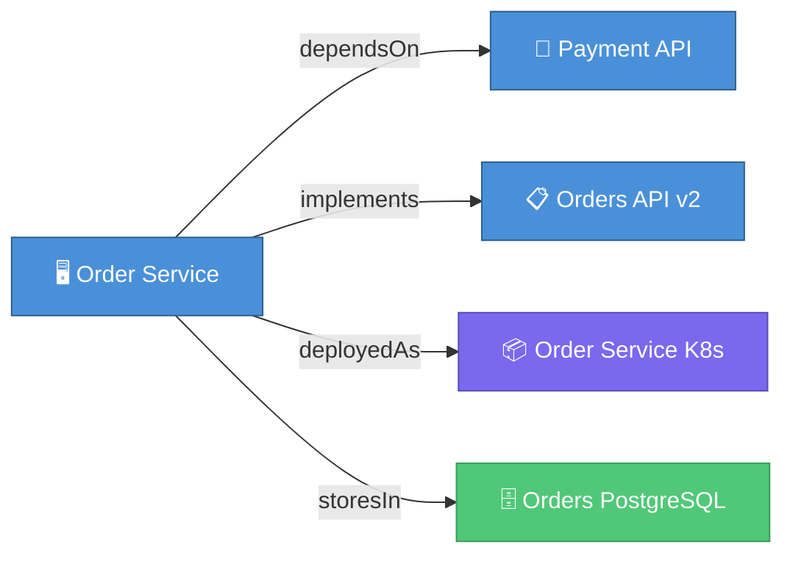
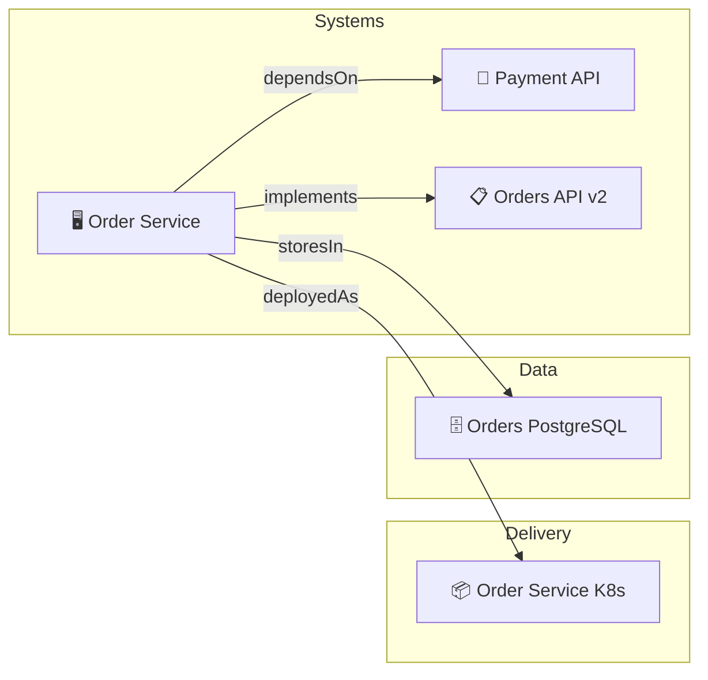
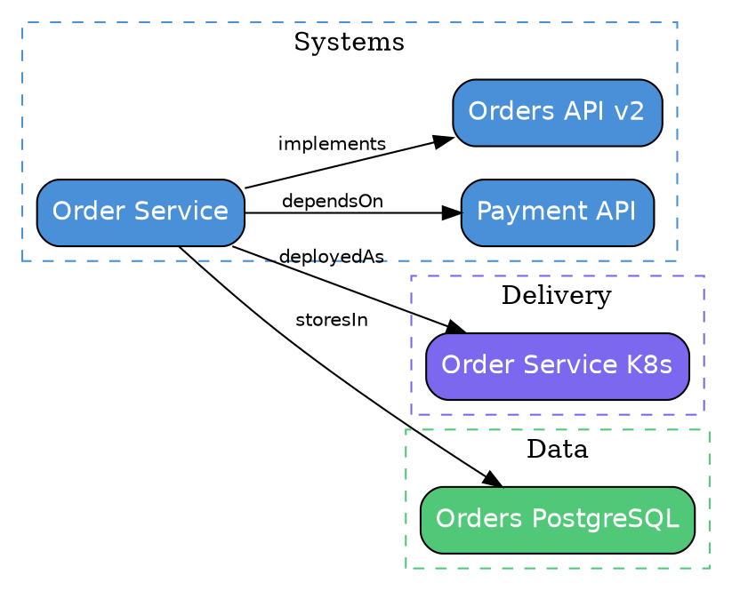

# EA Visualization Specification

This document defines the `ea graph` command's output formats, filtering options, layout strategies, and interactive visualization capabilities.

Read [ea-design-overview.md](./ea-design-overview.md) and [ea-relationship-model.md](./ea-relationship-model.md) for context.

---

## 1. The `ea graph` Command

```bash
# Default: Mermaid output to stdout
npx anchored-spec ea graph

# Specific output format
npx anchored-spec ea graph --format mermaid
npx anchored-spec ea graph --format dot
npx anchored-spec ea graph --format json
npx anchored-spec ea graph --format html

# Write to file
npx anchored-spec ea graph --format mermaid --output architecture.md
npx anchored-spec ea graph --format html --output architecture.html

# Filtering
npx anchored-spec ea graph --domain systems
npx anchored-spec ea graph --domain systems,delivery
npx anchored-spec ea graph --kind application,service
npx anchored-spec ea graph --focus APP-order-service --depth 2
npx anchored-spec ea graph --status active
npx anchored-spec ea graph --exclude-virtual

# Federation
npx anchored-spec ea graph --federated
```

---

## 2. Output Formats

### 2.1 Mermaid (Default)

[Mermaid](https://mermaid.js.org/) diagrams render in GitHub, GitLab, Notion, and many documentation tools.

```bash
npx anchored-spec ea graph --format mermaid
```

**Output:**

````markdown

````

**Mermaid-Specific Options:**

| Option | Default | Description |
|---|---|---|
| `--direction` | `LR` | Graph direction: `LR` (left-right), `TB` (top-bottom), `RL`, `BT` |
| `--show-labels` | `true` | Show relation type labels on edges |
| `--show-icons` | `true` | Prefix node labels with kind-specific emoji |
| `--group-by-domain` | `false` | Wrap nodes in Mermaid subgraphs by domain |

**Domain Grouping Output:**

````markdown

````

### 2.2 DOT (Graphviz)

For high-quality static diagrams using [Graphviz](https://graphviz.org/).

```bash
npx anchored-spec ea graph --format dot --output architecture.dot
dot -Tpng architecture.dot -o architecture.png
dot -Tsvg architecture.dot -o architecture.svg
```

**Output:**



**DOT-Specific Options:**

| Option | Default | Description |
|---|---|---|
| `--layout` | `dot` | Graphviz layout engine: `dot`, `neato`, `fdp`, `circo`, `twopi` |
| `--cluster-domains` | `true` | Group nodes by domain in subgraph clusters |
| `--node-shape` | `box` | Graphviz node shape |

### 2.3 JSON (Programmatic)

Machine-readable format for custom visualization tools or analysis scripts.

```bash
npx anchored-spec ea graph --format json
```

**Output:**

```json
{
  "generatedAt": "2026-03-29T08:00:00Z",
  "nodes": [
    {
      "id": "APP-order-service",
      "kind": "application",
      "domain": "systems",
      "label": "Order Service",
      "status": "active",
      "confidence": "declared",
      "owners": ["team-commerce"],
      "remote": false,
      "metadata": {
        "tags": ["core", "revenue-critical"]
      }
    }
  ],
  "edges": [
    {
      "source": "APP-order-service",
      "target": "SVC-payment-api",
      "type": "dependsOn",
      "isVirtual": false,
      "metadata": {
        "criticality": "high"
      }
    },
    {
      "source": "SVC-payment-api",
      "target": "APP-order-service",
      "type": "dependedOnBy",
      "isVirtual": true
    }
  ],
  "stats": {
    "totalNodes": 15,
    "totalEdges": 22,
    "edgesByType": {
      "dependsOn": 3,
      "implements": 2,
      "deployedAs": 3,
      "storesIn": 2
    },
    "nodesByDomain": {
      "systems": 5,
      "delivery": 3,
      "data": 3,
      "transitions": 4
    },
    "connectedComponents": 1,
    "orphans": []
  }
}
```

### 2.4 Interactive HTML

A self-contained HTML file with an interactive, zoomable, filterable graph using [D3.js](https://d3js.org/) force-directed layout.

```bash
npx anchored-spec ea graph --format html --output architecture.html
```

**Features:**
- Force-directed layout with drag-and-drop nodes
- Zoom and pan
- Click a node to see its metadata panel
- Filter by domain, kind, status (checkboxes)
- Search by artifact name or ID
- Toggle virtual inverse edges
- Highlight path between two selected nodes
- Color-coded by domain
- Edge labels shown on hover

**HTML Structure:**

```html
<!DOCTYPE html>
<html>
<head>
  <title>EA Architecture Graph</title>
  <style>/* Embedded CSS for self-contained file */</style>
</head>
<body>
  <div id="controls">
    <input type="text" id="search" placeholder="Search artifacts...">
    <div id="domain-filters"><!-- Domain checkboxes --></div>
    <div id="kind-filters"><!-- Kind checkboxes --></div>
    <label><input type="checkbox" id="show-virtual"> Show virtual edges</label>
  </div>
  <div id="graph"><!-- D3 SVG renders here --></div>
  <div id="detail-panel"><!-- Selected node metadata --></div>
  <script>
    // Embedded graph data
    const GRAPH_DATA = { /* JSON graph data inlined */ };
    // D3 force-directed visualization code
    // ... (self-contained, no external dependencies)
  </script>
</body>
</html>
```

---

## 3. Filtering Options

All filters can be combined:

| Filter | Flag | Example | Behavior |
|---|---|---|---|
| Domain | `--domain` | `--domain systems,delivery` | Only include artifacts from specified domains |
| Kind | `--kind` | `--kind application,service` | Only include artifacts of specified kinds |
| Status | `--status` | `--status active` | Only include artifacts with specified status |
| Confidence | `--confidence` | `--confidence declared` | Only include artifacts with specified confidence |
| Focus | `--focus` | `--focus APP-order-service` | Center on a specific artifact |
| Depth | `--depth` | `--depth 2` | Max edge traversal depth from focus node (requires `--focus`) |
| Tags | `--tag` | `--tag core` | Only include artifacts with specified tag |
| Owner | `--owner` | `--owner team-commerce` | Only include artifacts owned by specified team |
| Exclude virtual | `--exclude-virtual` | | Omit virtual inverse edges |
| Include remote | `--federated` | | Include remote artifacts from federation |

### Focus + Depth Filtering

The `--focus` + `--depth` combination produces a subgraph centered on one artifact:

```bash
# Show APP-order-service and everything within 2 hops
npx anchored-spec ea graph --focus APP-order-service --depth 2
```

**Algorithm:**
1. Start at the focus node
2. BFS outward following both forward and inverse edges
3. Stop at `depth` hops
4. Include all edges between the collected nodes

---

## 4. Kind-Specific Icons

Each kind has an assigned emoji icon for visual differentiation:

| Kind | Icon | Kind | Icon |
|---|---|---|---|
| `application` | 🖥 | `data-store` | 🗄 |
| `service` | 🔌 | `data-object` | 📊 |
| `api-contract` | 📋 | `data-flow` | 🔄 |
| `system-interface` | 🔗 | `data-quality-rule` | ✅ |
| `consumer` | 👤 | `schema-registry` | 📚 |
| `deployment` | 📦 | `data-classification` | 🏷 |
| `pipeline` | 🚀 | `retention-policy` | 🗓 |
| `cloud-resource` | ☁️ | `information-object` | 📄 |
| `environment` | 🌍 | `information-flow` | ➡️ |
| `technology-standard` | 📏 | `vocabulary` | 📖 |
| `business-capability` | 🎯 | `classification-scheme` | 🏛 |
| `business-process` | ⚙️ | `baseline` | 📸 |
| `business-service` | 🛎 | `target` | 🎯 |
| `business-rule` | 📜 | `transition-plan` | 🗺 |
| `organization-unit` | 🏢 | `migration-wave` | 🌊 |
| `actor` | 🧑 | `exception` | ⚠️ |
| `value-stream` | 💰 | `kpi` | 📈 |

---

## 5. Domain Color Palette

| Domain | Primary Color | Fill | Border |
|---|---|---|---|
| `systems` | Blue | `#4A90D9` | `#2C5F8A` |
| `delivery` | Purple | `#7B68EE` | `#5A4CB5` |
| `data` | Green | `#50C878` | `#3A9A5A` |
| `information` | Teal | `#20B2AA` | `#178A84` |
| `business` | Orange | `#FF8C42` | `#CC7035` |
| `transitions` | Amber | `#FFB347` | `#CC8F39` |

---

## 6. Edge Styling

| Edge Property | Style |
|---|---|
| Canonical (stored) relation | Solid line, arrow at target |
| Virtual inverse | Dashed line, lighter color |
| Cross-domain edge | Thicker line weight |
| Critical relation (metadata.criticality: "high") | Red color |
| Deprecated target | Strikethrough label, gray edge |

---

## 7. Report-Specific Visualizations

Beyond the general `ea graph`, specific reports produce specialized visualizations:

### 7.1 Dependency Matrix

```bash
npx anchored-spec ea report --type dependency-matrix --format html
```

A grid/matrix where rows and columns are artifacts, and cells indicate relation types. Useful for spotting unexpected dependencies and circular references.

```
                    APP-order  SVC-payment  STORE-orders  DEP-order-k8s
APP-order-service      —       dependsOn    storesIn      deployedAs
SVC-payment-api        —          —            —              —
STORE-orders-postgres  —          —            —              —
DEP-order-service-k8s  —          —            —              —
```

### 7.2 Capability Map

```bash
npx anchored-spec ea report --type capability-map --format html
```

A treemap or nested box visualization showing business capabilities and the systems/services that realize them.

```
┌─────────────────────────────────────────────────┐
│  Order Management (CAP-order-management)        │
│  ┌──────────────────┐ ┌──────────────────────┐  │
│  │ APP-order-service │ │ STORE-orders-postgres│  │
│  └──────────────────┘ └──────────────────────┘  │
├─────────────────────────────────────────────────┤
│  Payment Processing (CAP-payment-processing)    │
│  ┌──────────────────┐                           │
│  │ SVC-payment-api  │                           │
│  └──────────────────┘                           │
└─────────────────────────────────────────────────┘
```

### 7.3 Transition Timeline

```bash
npx anchored-spec ea report --type transition-timeline --format html
```

A Gantt-like visualization showing migration waves on a timeline:

```
2026
Apr        May        Jun        Jul        Aug        Sep
|─── Wave 1: Foundation ───|
                            |────── Wave 2: Migration ──────|
                                                            |─ Wave 3: Deprecation ─|
```

### 7.4 Drift Heatmap

```bash
npx anchored-spec ea report --type drift-heatmap --format html
```

A heatmap showing drift severity by artifact. Red = errors, yellow = warnings, green = clean.

---

## 8. Implementation Notes

### Graph Builder Output Interface

```typescript
export interface GraphVisualization {
  nodes: GraphVisNode[];
  edges: GraphVisEdge[];
  stats: GraphStats;
}

export interface GraphVisNode {
  id: string;
  kind: string;
  domain: EaDomain;
  label: string;
  status: string;
  confidence: string;
  owners: string[];
  tags: string[];
  remote: boolean;
  sourceRepo?: string;
  icon: string;        // Emoji icon for the kind
  color: string;       // Hex color for the domain
}

export interface GraphVisEdge {
  source: string;
  target: string;
  type: string;
  label: string;       // Human-readable label
  isVirtual: boolean;
  crossDomain: boolean;
  metadata?: Record<string, unknown>;
}

export interface GraphStats {
  totalNodes: number;
  totalEdges: number;
  edgesByType: Record<string, number>;
  nodesByDomain: Record<string, number>;
  nodesByKind: Record<string, number>;
  connectedComponents: number;
  orphans: string[];
  maxDepth: number;
}
```

### Formatter Interface

```typescript
export interface GraphFormatter {
  /** Format identifier */
  format: 'mermaid' | 'dot' | 'json' | 'html';
  /** File extension for output */
  extension: string;
  /** Render the graph to a string */
  render(graph: GraphVisualization, options: GraphFormatOptions): string;
}

export interface GraphFormatOptions {
  direction?: 'LR' | 'TB' | 'RL' | 'BT';
  showLabels?: boolean;
  showIcons?: boolean;
  groupByDomain?: boolean;
  showVirtual?: boolean;
  title?: string;
}
```

### CLI Registration

```typescript
// src/cli/commands/ea-graph.ts
export const eaGraphCommand = new Command('graph')
  .description('Visualize the EA relation graph')
  .option('--format <format>', 'Output format', 'mermaid')
  .option('--output <file>', 'Write to file instead of stdout')
  .option('--domain <domains>', 'Filter by domain (comma-separated)')
  .option('--kind <kinds>', 'Filter by kind (comma-separated)')
  .option('--focus <id>', 'Center on a specific artifact')
  .option('--depth <n>', 'Max traversal depth from focus', parseInt)
  .option('--status <status>', 'Filter by status')
  .option('--tag <tag>', 'Filter by tag')
  .option('--owner <owner>', 'Filter by owner')
  .option('--exclude-virtual', 'Omit virtual inverse edges')
  .option('--federated', 'Include remote artifacts')
  .option('--direction <dir>', 'Graph direction (Mermaid/DOT)', 'LR')
  .option('--group-by-domain', 'Group nodes by domain')
  .action(handleEaGraph);
```
