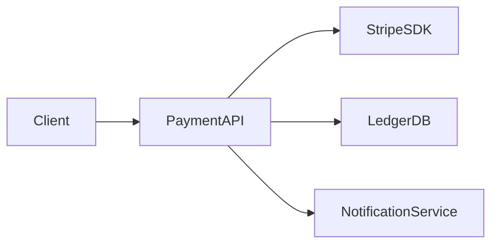

# Payment Service

The payment service handles all monetary transactions for the platform.

## Architecture

## Key Flows

### Charge Flow

1. Client submits payment intent
2. Service validates amount and currency
3. Stripe charge created
4. Ledger entry written
5. Confirmation sent via notification service

<!-- @anchored-spec:events payment-events -->

| Event | Payload | Description |
|---|---|---|
| payment.created | PaymentIntent | New payment initiated |
| payment.succeeded | PaymentResult | Payment completed successfully |
| payment.failed | PaymentError | Payment processing failed |
| payment.refunded | RefundResult | Payment refunded |

<!-- @anchored-spec:end -->

## API Contract

See [Payments API](./payments-api.md) for the full OpenAPI specification.
