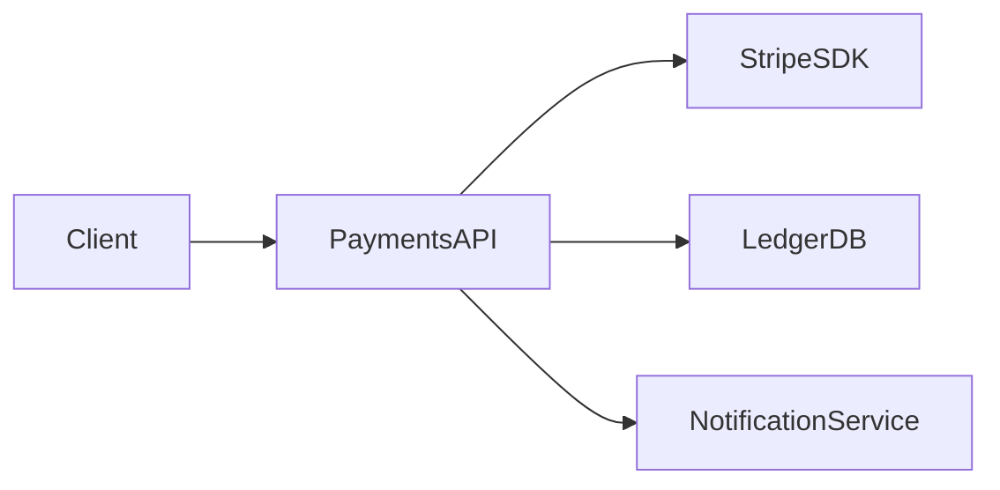

# Payment Service

The payment service is the runtime component responsible for payment intent creation, settlement tracking, refund orchestration, and ledger writes.

## Role in the model

This document demonstrates inline mode: the entity descriptor lives in the frontmatter, and the narrative architecture notes live in the Markdown body.

The service provides `api:default/payments-api` and depends on a ledger resource used for durable transaction tracking.

## Runtime shape

## Key flow

1. a client submits a payment request
2. the service validates the business and currency rules
3. the external payment provider is called
4. the internal ledger is updated
5. downstream notification or audit workflows are triggered

<!-- @anchored-spec:events payment-events -->
| Event | Payload | Description |
|---|---|---|
| payment.created | PaymentIntent | A new payment request entered the system |
| payment.authorized | AuthorizationResult | A provider authorization succeeded |
| payment.failed | PaymentError | The payment could not be completed |
| payment.refunded | RefundResult | Funds were returned to the customer |
<!-- @anchored-spec:end -->

## Related entity

See [Payments API](./payments-api.md) for the contract this component exposes.
