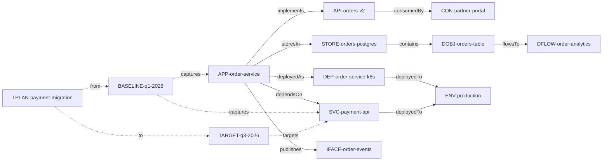

# EA Example Project — E-Commerce Platform

This directory contains a realistic 15-artifact EA fixture set for an e-commerce platform. It demonstrates the unified artifact model, relations, anchors, transitions, and exceptions.

## Artifacts

### Systems Domain (5 artifacts)
- `APP-order-service` — Core order processing application
- `SVC-payment-api` — Payment processing API service
- `API-orders-v2` — Versioned API contract for orders
- `IFACE-order-events` — Event-driven interface (Kafka)
- `CON-partner-portal` — External consumer of the orders API

### Delivery Domain (3 artifacts)
- `DEP-order-service-k8s` — Kubernetes deployment for order service
- `PIPE-order-service-ci` — CI/CD pipeline
- `ENV-production` — Production environment

### Data Domain (3 artifacts)
- `STORE-orders-postgres` — PostgreSQL database for orders
- `DOBJ-orders-table` — The orders table schema
- `DFLOW-order-analytics` — ETL pipeline to analytics warehouse

### Transitions Domain (3 artifacts)
- `BASELINE-q1-2026` — Current state baseline
- `TARGET-q3-2026` — Target state (payment service migration)
- `TPLAN-payment-migration` — Transition plan for the migration

### Exceptions (1 artifact)
- `EXC-legacy-payment-endpoint` — Exception for undocumented legacy endpoint

## Usage

These files serve as:
1. **Test fixtures** for EA validation, drift, and graph tests
2. **Documentation examples** showing correct artifact structure
3. **Onboarding reference** for teams adopting EA

## Relation Graph

