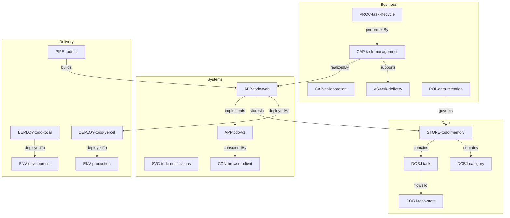

# Todo App — anchored-spec EA Example

A full-stack Todo application built with Next.js 16, React 19, and Tailwind CSS v4.
This example demonstrates how to model a real application using the **anchored-spec
Enterprise Architecture (EA)** framework with a complex multi-phase workflow.

## Features

- **CRUD Operations** — Create, read, update, and delete todos via REST API
- **Priorities** — Low, medium, high, and urgent with visual indicators
- **Categories** — Work, Personal, Shopping, Health, Learning
- **Filtering** — Search, filter by status/priority/category
- **Due Dates** — With overdue detection and warnings
- **Stats Dashboard** — Real-time completion rates and distribution
- **Status Lifecycle** — Pending → In Progress → Completed → Archived

## Quick Start

```bash
cd examples/todo-app
npm install
npm run dev
# Open http://localhost:3000
```

## Architecture (EA-Modeled)

This app is fully modeled using anchored-spec EA artifacts across 6 domains:

```
ea/
├── business/           # Capabilities, processes, value streams, policies
│   ├── CAP-task-management.yaml
│   ├── CAP-collaboration.yaml
│   ├── PROC-task-lifecycle.yaml
│   ├── VS-task-delivery.yaml
│   └── POL-data-retention.yaml
├── systems/            # Applications, APIs, services, consumers
│   ├── APP-todo-web.yaml
│   ├── API-todo-v1.yaml
│   ├── SVC-todo-notifications.yaml
│   └── CON-browser-client.yaml
├── data/               # Stores, data objects, computed views
│   ├── STORE-todo-memory.yaml
│   ├── DOBJ-task.yaml
│   ├── DOBJ-category.yaml
│   └── DOBJ-todo-stats.yaml
├── information/        # Canonical entities, glossary terms
│   ├── CE-task-entity.yaml
│   └── TERM-todo.yaml
├── delivery/           # Environments, deployments, pipelines
│   ├── ENV-development.yaml
│   ├── ENV-production.yaml
│   ├── DEPLOY-todo-local.yaml
│   ├── DEPLOY-todo-vercel.yaml
│   └── PIPE-todo-ci.yaml
├── transitions/        # Baselines, targets, migration plans, exceptions
│   ├── BASELINE-v0-1.yaml
│   ├── TARGET-v1-0.yaml
│   ├── PLAN-persistence-migration.yaml
│   └── EXCEPT-no-auth-dev.yaml
└── workflow-policy.yaml
```

### Relation Graph



## Complex Workflow

The `ea/workflow-policy.yaml` defines a comprehensive development workflow:

### Workflow Variants
| Variant | Trigger | Requirements |
|---------|---------|-------------|
| Feature (Behavior First) | feature, enhancement | Requirements artifact, design doc |
| Fix (Root Cause First) | fix, hotfix | Root-cause analysis |
| Chore (Lightweight) | chore, refactor, docs | None (skip skill sequence) |

### Change-Required Rules
| Rule | Scope | Requires |
|------|-------|----------|
| API Route Change | `app/api/**` | API contract artifact |
| Component Change | `components/**` | Design review |
| Data Model Change | `lib/types.ts`, `lib/store.ts` | Data model update |
| Config Change | `*.config.*`, `tsconfig.json` | Deployment review |

### Lifecycle Gates
- **planned → active** requires a change artifact
- **active → shipped** requires test evidence coverage
- **deprecated** requires a reason and replacement
- **retired** requires a completed migration plan

## Migration Plan (3 Waves)

The `ea/transitions/PLAN-persistence-migration.yaml` defines a three-wave
migration from the current in-memory prototype to a production-ready system:

| Wave | Name | Timeline | Key Changes |
|------|------|----------|-------------|
| 1 | Foundation | Apr–May 2026 | Add SQLite alongside in-memory (dual-write) |
| 2 | Cutover | May–Jul 2026 | Switch to SQLite primary + add auth |
| 3 | Enhancement | Jul–Sep 2026 | Notifications, Vercel deploy, deprecate in-memory |

## Validating the Architecture

From the repository root:

```bash
# Validate all artifacts
npx anchored-spec validate --root examples/todo-app

# View the dependency graph
npx anchored-spec graph --root examples/todo-app

# Check architecture drift
npx anchored-spec drift --root examples/todo-app

# Show status summary
npx anchored-spec status --root examples/todo-app
```
